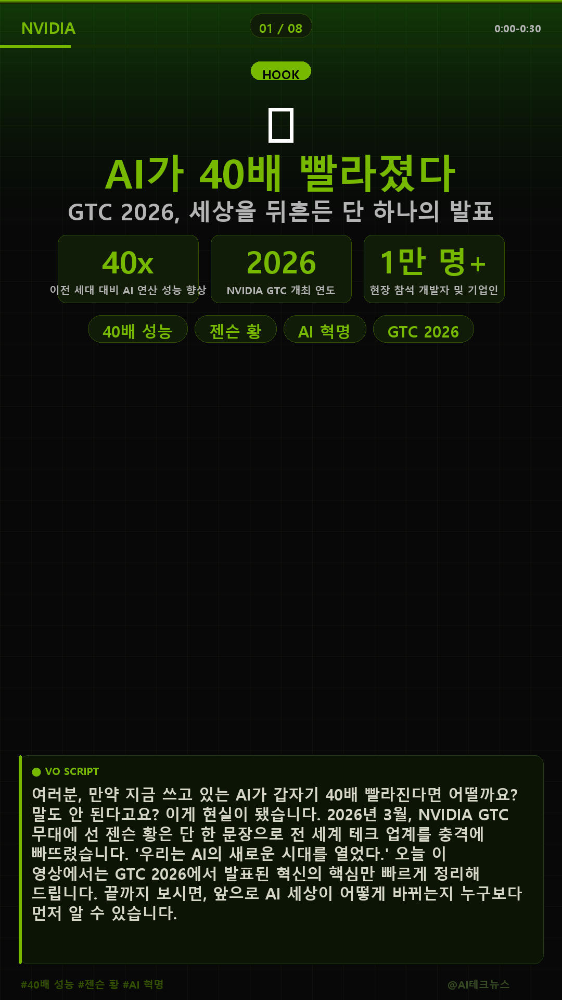
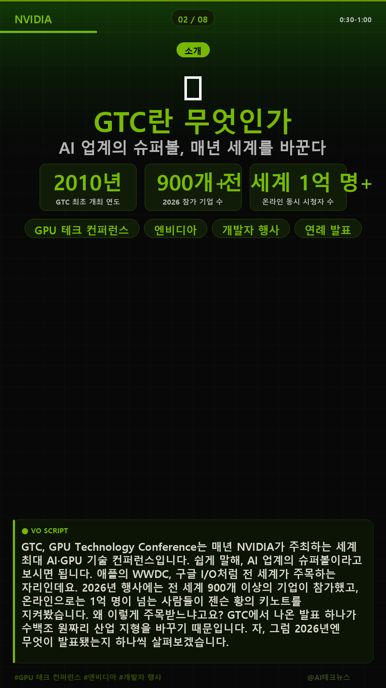
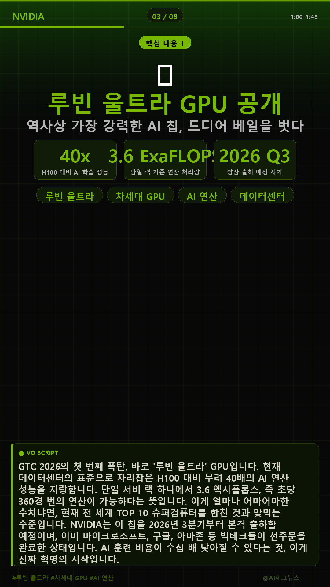
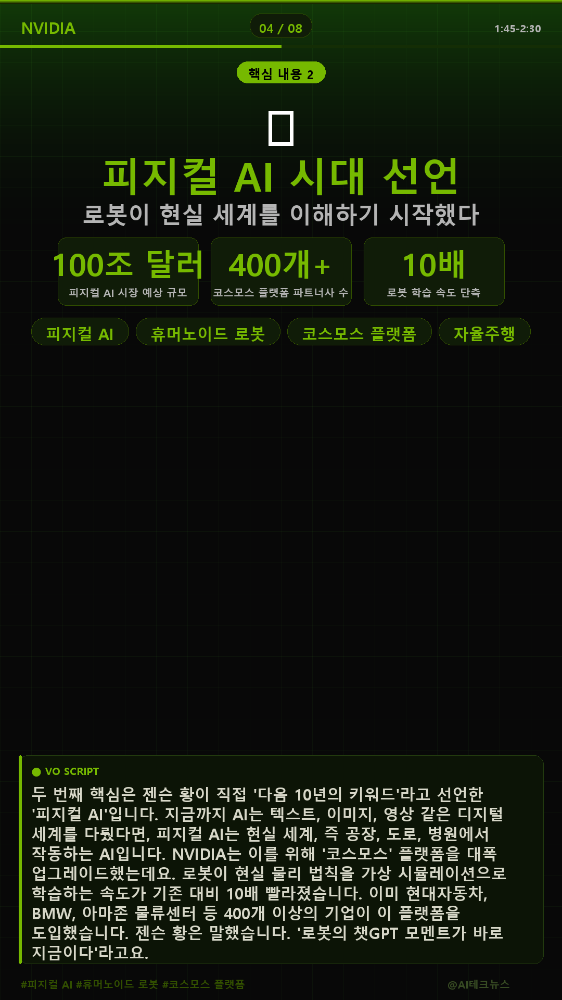

# Automated YouTube Shorts Creator

> **Powered by Claude AI · edge-tts · moviepy · Pillow**

An AI pipeline that automatically finds trending topics, generates scripts, creates slides, synthesizes voiceover, and assembles a YouTube Shorts MP4 — in **12 languages**.

**Language:** [한국어 (Korean)](README-KR.md) · **English**

---

## Sample Slides

> Generated with `python auto_video.py --topic "NVIDIA GTC 2026 AI Revolution" --lang ko`

<table>
  <tr>
    <td></td>
    <td></td>
    <td></td>
    <td></td>
  </tr>
  <tr>
    <td align="center">Slide 1 — HOOK</td>
    <td align="center">Slide 2 — INTRO</td>
    <td align="center">Slide 3 — CORE</td>
    <td align="center">Slide 4 — CORE</td>
  </tr>
</table>

- **Resolution**: 1080×1920 (9:16)
- **Design**: NVIDIA Green `#76B900` on Deep Black
- **Layout**: Section tag · Emoji icon · Headline · Stats · Chips · VO Script box

---

## Features

| Feature | Description |
|---------|-------------|
| Trend Discovery | Google Trends per country — auto-selects the hottest topic |
| AI Script | Claude generates structured JSON slides in the target language |
| Slide Images | PIL renders 1080×1920 (9:16) professional slides |
| Background Photos | DuckDuckGo auto-downloads topic-relevant images |
| TTS Voiceover | edge-tts — natural voices for every supported language |
| Subtitle Overlay | moviepy burns subtitles into the final MP4 |
| 12 Languages | `ko` `en` `ja` `zh` `es` `fr` `de` `pt` `ar` `hi` `it` `ru` |

---

## Requirements

- Python 3.9+
- Windows 10/11 recommended (CJK fonts built-in)
- FFmpeg — installed automatically via `imageio-ffmpeg`
- [Anthropic API key](https://console.anthropic.com/)

---

## Installation

```bash
# 1. Clone
git clone https://github.com/smaeung/automated-youtube.git
cd automated-youtube

# 2. Virtual environment (recommended)
python -m venv .venv

# Windows PowerShell
.\.venv\Scripts\Activate.ps1
# macOS / Linux / Git Bash
source .venv/bin/activate

# 3. Dependencies
pip install -r requirements.txt

# 4. API key
copy .env.example .env      # Windows
cp   .env.example .env      # macOS / Linux
```

Edit `.env`:

```env
ANTHROPIC_API_KEY=sk-ant-your-key-here
```

---

## Usage

### Auto mode (trend detection → full video)

```bash
python auto_video.py
```

### Specify topic

```bash
python auto_video.py --topic "GPT-5 vs Claude 4"
```

### Language selection

```bash
python auto_video.py --lang en          # English (US)
python auto_video.py --lang ja          # Japanese
python auto_video.py --lang zh          # Chinese (Simplified)
python auto_video.py --lang es          # Spanish
python auto_video.py --lang fr          # French
python auto_video.py --lang de          # German
python auto_video.py --lang pt          # Portuguese (Brazil)
python auto_video.py --lang ar          # Arabic
python auto_video.py --lang hi          # Hindi
python auto_video.py --lang it          # Italian
python auto_video.py --lang ru          # Russian
```

### Script only (no video rendering)

```bash
python auto_video.py --topic "AI Agents" --lang en --no-video
```

### Browse trending topics

```bash
python auto_video.py --lang ja --list-trends
```

### All options

```
Option            Default   Description
--topic TEXT      (auto)    Video topic
--slides N        8         Number of slides
--duration        5min      Video length: 1min / 3min / 5min / 10min
--voice           male      TTS gender: male / female
--lang            ko        Language code (see list below)
--output DIR      output    Output directory
--list-trends               Show top-10 trends and exit
--no-video                  Generate script only
```

---

## Supported Languages & TTS Voices

| Code | Language | Male Voice | Female Voice |
|------|----------|-----------|--------------|
| `ko` | Korean | ko-KR-InJoonNeural | ko-KR-SunHiNeural |
| `en` | English | en-US-GuyNeural | en-US-JennyNeural |
| `ja` | Japanese | ja-JP-KeitaNeural | ja-JP-NanamiNeural |
| `zh` | Chinese | zh-CN-YunjianNeural | zh-CN-XiaoxiaoNeural |
| `es` | Spanish | es-ES-AlvaroNeural | es-ES-ElviraNeural |
| `fr` | French | fr-FR-HenriNeural | fr-FR-DeniseNeural |
| `de` | German | de-DE-ConradNeural | de-DE-KatjaNeural |
| `pt` | Portuguese (BR) | pt-BR-AntonioNeural | pt-BR-FranciscaNeural |
| `ar` | Arabic | ar-SA-HamedNeural | ar-SA-ZariyahNeural |
| `hi` | Hindi | hi-IN-MadhurNeural | hi-IN-SwaraNeural |
| `it` | Italian | it-IT-DiegoNeural | it-IT-ElsaNeural |
| `ru` | Russian | ru-RU-DmitryNeural | ru-RU-SvetlanaNeural |

---

## Project Structure

```
automated-youtube/
├── auto_video.py            # Main CLI entry point
├── requirements.txt
├── .env.example
├── README.md                # Language index
├── README-EN.md             # This file
├── README-KR.md             # Korean docs
│
└── modules/
    ├── trend_finder.py      # Google Trends per country + fallback topics
    ├── script_gen.py        # Claude AI — generates JSON script in target language
    ├── image_search.py      # DuckDuckGo image search & download
    ├── slide_maker.py       # PIL 1080×1920 slides — per-language fonts
    ├── tts_engine.py        # edge-tts — 12-language voice map
    └── video_builder.py     # moviepy — slide + audio + subtitle → MP4
```

---

## Pipeline

```
STEP 1  Trend      Google Trends (country per lang) → best topic
STEP 2  Script     Claude API → structured JSON (title, hashtags, slides)
STEP 3  Images     DuckDuckGo → topic background photos
STEP 4  Slides     PIL 1080×1920 → slide_01.png … slide_N.png
STEP 5  Audio      edge-tts → audio_01.mp3 … audio_N.mp3
STEP 6  Video      moviepy → subtitle overlay → {topic}_YYYYMMDD.mp4
```

---

## Slide Design

- **Resolution**: 1080×1920 (9:16 YouTube Shorts)
- **Colors**: NVIDIA Green `#76B900` + Deep Black `#000000`
- **Fonts**: auto-selected per language
  - Korean/Japanese/Chinese → system CJK fonts (Malgun, YuGothic, YaHei)
  - Latin (EN/ES/FR/DE/PT/IT) → Arial Bold
  - Arabic → ArabType / Arial
  - Hindi → Nirmala UI
  - Russian → Arial (Cyrillic)
- **Layout**: Section tag · Icon · Headline · Sub-headline · Stats · Chips · VO Script box

---

## Troubleshooting

### Encoding error on Windows

```bash
set PYTHONIOENCODING=utf-8
python auto_video.py
```

### pytrends fails

Falls back automatically to a built-in list of curated topics for the selected language.

### No background images

```
[skip] duckduckgo-search not installed — using gradient background
```

Install with: `pip install duckduckgo-search`

### Arabic slide rendering

PIL does not support RTL text natively — Arabic slides will render left-to-right visually. TTS audio is fully correct. For proper RTL rendering, install `arabic-reshaper` and `python-bidi`.

### moviepy install error

```bash
pip install "moviepy>=1.0.3,<2.0.0" imageio-ffmpeg
```

---

## Dependencies

```
anthropic>=0.40.0         Claude AI API
edge-tts>=6.1.9           Microsoft free TTS (12 languages)
moviepy>=1.0.3,<2.0.0     Video editing
imageio-ffmpeg>=0.4.9     Auto-installs FFmpeg
Pillow>=10.0.0            Image processing
pytrends>=4.9.2           Google Trends API
requests>=2.31.0          HTTP
python-dotenv>=1.0.0      Environment variables
numpy>=1.24.0             Array operations
duckduckgo-search>=6.0.0  Free image search (no API key needed)
```

---

## License

MIT License

---

## Credits

- [Anthropic Claude](https://anthropic.com) — AI script generation
- [edge-tts](https://github.com/rany2/edge-tts) — Microsoft Neural TTS
- [MoviePy](https://zulko.github.io/moviepy/) — Video editing in Python
- [Pillow](https://pillow.readthedocs.io/) — Image processing
- [DuckDuckGo Search](https://github.com/deedy5/duckduckgo_search) — Free image search
