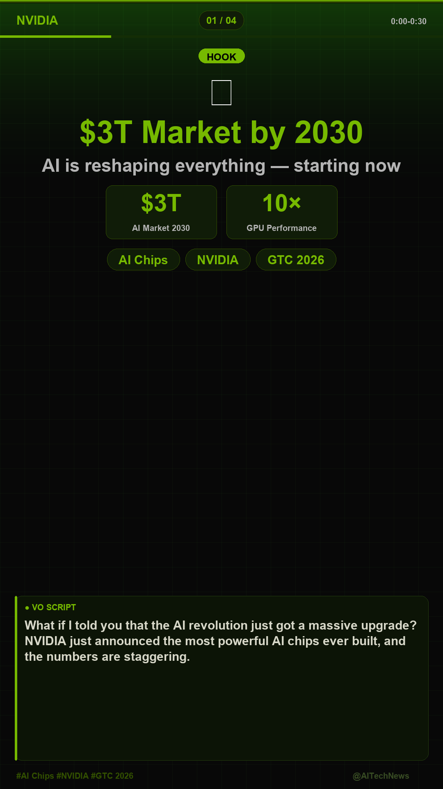
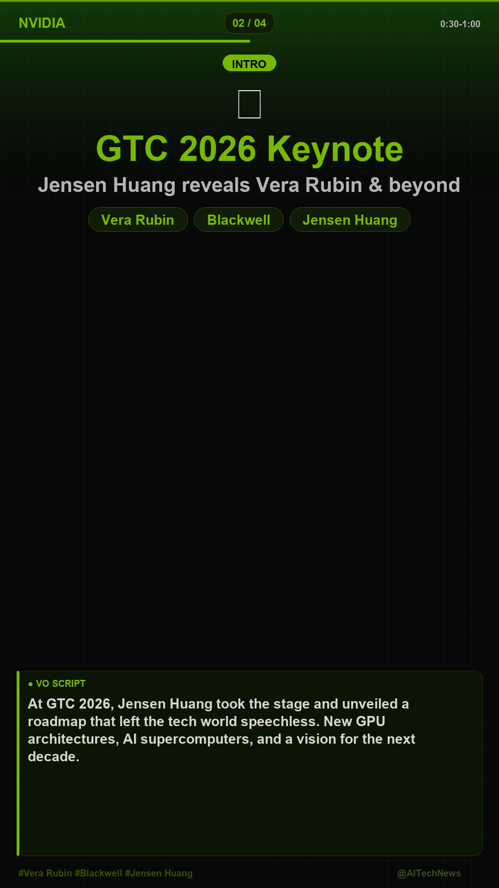
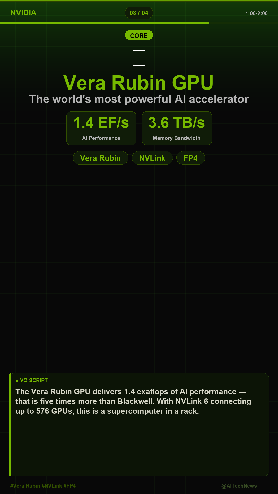
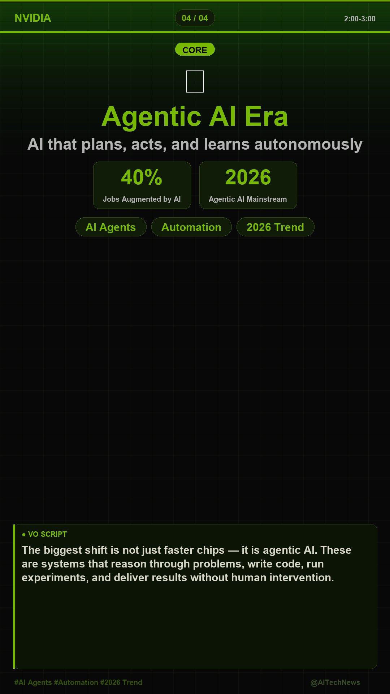

# Automated YouTube Shorts Creator

> **Powered by Claude AI · edge-tts · moviepy · Pillow**

An AI pipeline that automatically finds trending topics and produces YouTube Shorts videos — in **12 languages**.

---

## Language / 언어

| | README |
|---|---|
| English | **[README-EN.md](README-EN.md)** |
| 한국어 | **[README-KR.md](README-KR.md)** |

---

## Quick Start

```bash
# Clone & install
git clone https://github.com/smaeung/automated-youtube.git
cd automated-youtube
pip install -r requirements.txt

# Set your API key
echo ANTHROPIC_API_KEY=sk-ant-... > .env

# Run (Korean, default)
python auto_video.py

# Run in English
python auto_video.py --lang en

# Run in Japanese
python auto_video.py --lang ja
```

## Sample Output

**Korean (`--lang ko`)**

<table>
  <tr>
    <td></td>
    <td></td>
    <td></td>
    <td></td>
  </tr>
</table>

**English (`--lang en`)**

<table>
  <tr>
    <td></td>
    <td></td>
    <td></td>
    <td></td>
  </tr>
</table>

*1080×1920 · NVIDIA Green design · VO Script box · Subtitle overlay MP4*

## Supported Languages

`ko` · `en` · `ja` · `zh` · `es` · `fr` · `de` · `pt` · `ar` · `hi` · `it` · `ru`
